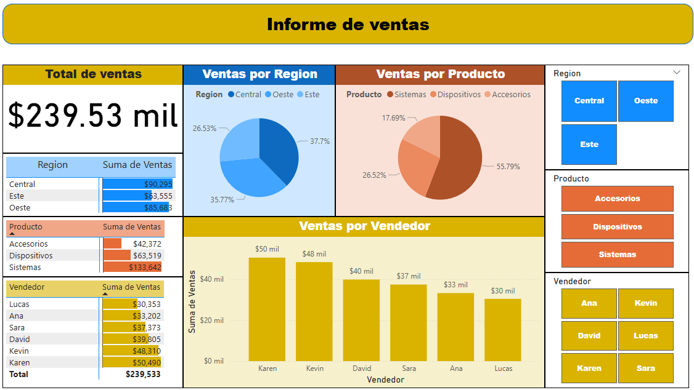
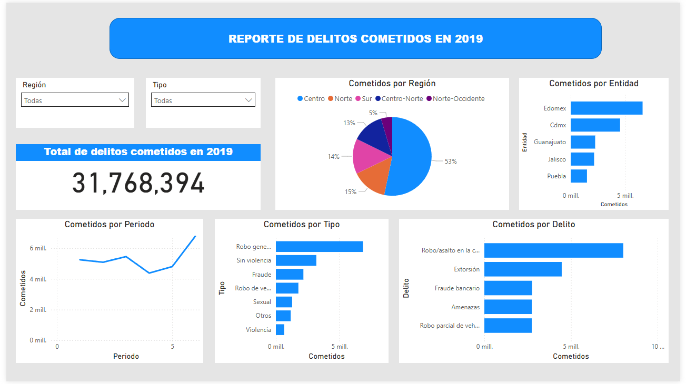
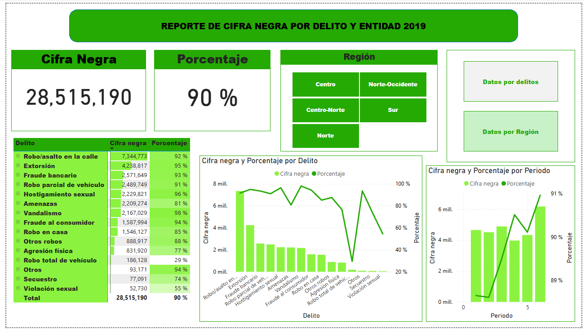
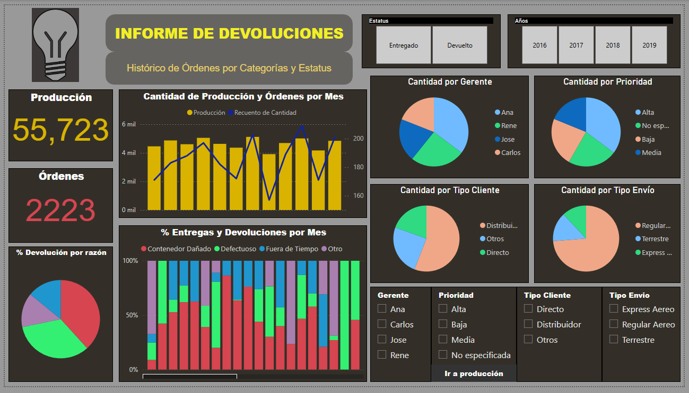

📊 Visualización de datos con Power BI

En este repositorio encontrarás los archivos trabajados en cada clase del curso de Power BI, incluyendo reportes y dashboards.

📁 Estructura del Repositorio

El repositorio está organizado en las siguientes carpetas:

Clase01.

Clase02.

Clase03.

Clase04.

Clase05_1.

Clase05_2.

Cada carpeta contiene:

✅ Archivos de Power BI utilizados en la clase (.pbix)

✅ Algunas clases incluyen imágenes de los dashboards creados.

📷 Vista previa de dashboards

Algunas clases incluyen capturas de los dashboards generados. Aquí tienes unos ejemplos:

